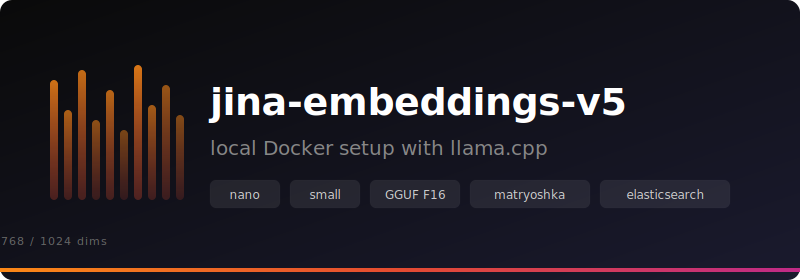

<p align="center">
  
</p>

# Jina Embeddings v5 Text — llama.cpp Docker Setup

Self-hosted embedding server for [jina-embeddings-v5-text](https://huggingface.co/collections/jinaai/jina-embeddings-v5-text) retrieval models using llama.cpp.

Supports two model sizes:

| | Nano | Small |
|---|---|---|
| Parameters | 239M | 596M |
| Embedding dims | 768 | 1024 |
| F16 model size | ~424 MB | ~1.1 GB |
| Matryoshka dims | 32–768 | 32–1024 |
| Architecture | EuroBERT | Qwen3 |

> [!NOTE]
> The nano model uses the EuroBERT architecture, which isn't in mainline llama.cpp yet. Both Dockerfiles clone and build from [Jina's fork](https://github.com/jina-ai/llama.cpp/tree/feat-jina-v5-text) that adds support for it.

## Project Structure

```
├── Dockerfile              # CPU build on debian:bookworm-slim
├── Dockerfile.cuda         # NVIDIA CUDA build on nvidia/cuda runtime
├── docker-compose.yml      # Service definitions with nano/small profiles
├── docker-compose.cuda.yml # Compose override for GPU support
├── download-model.sh       # Downloads the F16 GGUF model from HuggingFace
└── models/                 # Model files (created by download script)
```

## Quick Start

```bash
# 1. Download a model
./download-model.sh nano    # ~424 MB
./download-model.sh small   # ~1.1 GB

# 2. Build and start the server
docker compose --profile nano up --build
# or
docker compose --profile small up --build
```

The OpenAI-compatible embedding API will be available at `http://localhost:8080`.

## Usage

Generate embeddings via the `/v1/embeddings` endpoint:

```bash
curl -s http://localhost:8080/v1/embeddings \
  -H "Content-Type: application/json" \
  -d '{
    "input": [
      "Query: What is deep learning?",
      "Document: Deep learning is a subset of machine learning that uses neural networks with many layers."
    ]
  }' | jq .
```

> [!IMPORTANT]
> For the retrieval variant, prefix inputs with `Query: ` or `Document: ` to get proper asymmetric embeddings for search use cases.

## Elasticsearch Integration

Register the inference endpoint:

```json
PUT _inference/text_embedding/jina-local
{
  "service": "openai",
  "service_settings": {
    "api_key": "unused",
    "model_id": "jina-embeddings-v5-text",
    "url": "http://host.docker.internal:8080/v1/embeddings",
    "dimensions": 768
  }
}
```

Use `"dimensions": 1024` for the small model.

Create an ingest pipeline that prepends `Document: ` at index time:

```json
PUT _ingest/pipeline/jina-embeddings
{
  "description": "Generate embeddings with jina-embeddings-v5-text-retrieval",
  "processors": [
    {
      "script": {
        "source": "ctx._inference_input = 'Document: ' + ctx.content"
      }
    },
    {
      "inference": {
        "model_id": "jina-local",
        "input_output": {
          "input_field": "_inference_input",
          "output_field": "content_embedding"
        }
      }
    },
    {
      "remove": {
        "field": "_inference_input"
      }
    }
  ]
}
```

The model supports [Matryoshka embeddings](https://huggingface.co/blog/matryoshka) — the first N dimensions are independently meaningful, so you can truncate for smaller/faster vectors. Supported dimensions are **32, 64, 128, 256, 512, 768**.
Add a script processor to the pipeline to truncate (e.g. to 32 dims):

```json
PUT _ingest/pipeline/jina-embeddings-32
{
  "description": "Generate embeddings with jina-embeddings-v5-text-retrieval",
  "processors": [
    {
      "script": {
        "source": "ctx._inference_input = 'Document: ' + ctx.content"
      }
    },
    {
      "inference": {
        "model_id": "jina-local",
        "input_output": {
          "input_field": "_inference_input",
          "output_field": "content_embedding"
        }
}
    },
{
      "script": {
        "source": "def dims = 32; def result = []; for (int i = 0; i < dims; i++) { result.add(ctx.content_embedding[i]); } ctx.content_embedding = result;"
}
    },
{
      "remove": {
        "field": "_inference_input"
      }
  }
  ]
}
```

Create the index with matching dimensions:


> [!WARNING]
> `query_vector_builder` returns full-dimension vectors from the inference endpoint and does not truncate them to match the index. For truncated Matryoshka indexes, you need to fetch the query embedding via `POST _inference/text_embedding/jina-local`, slice the array to the target dimension, and pass it as `query_vector`. Full-dimension indexes (768/1024) can use `query_vector_builder` directly.

```json
PUT jina-demo
{
  "settings": {
    "default_pipeline": "jina-embeddings"
  },
  "mappings": {
    "properties": {
      "content": {
        "type": "text"
      },
      "content_embedding": {
        "type": "dense_vector",
        "dims": 768,
        "index": true
      }
    }
  }
}
```

Add example documents with the `_bulk` API:

```json
POST jina-demo/_bulk
{"index":{}}
{"content":"To resolve an out-of-memory error in Kubernetes, increase the resource limits in your pod spec. Set resources.limits.memory to a higher value and redeploy. If the OOMKilled status persists, profile your application's heap usage to find the leak."}
{"index":{}}
{"content":"SSH connections timing out are usually caused by firewalls dropping idle connections. Add ServerAliveInterval 60 to your ~/.ssh/config to send keepalive packets. If using a jump host, ensure the ProxyJump directive is configured correctly."}
{"index":{}}
{"content":"PostgreSQL slow queries can often be fixed by adding appropriate indexes. Run EXPLAIN ANALYZE on the problematic query to identify sequential scans on large tables. Consider partial indexes if only a subset of rows is frequently queried."}
{"index":{}}
{"content":"When a Docker container exits immediately after starting, check the entrypoint and command. Run docker logs <container_id> to see stderr output. Common causes include missing environment variables, incorrect file permissions, or a crashing application process."}
{"index":{}}
{"content":"Rate limiting in API design protects backend services from abuse. Implement it using a token bucket or sliding window algorithm. Return HTTP 429 with a Retry-After header so clients know when to retry."}
{"index":{}}
{"content":"Git merge conflicts occur when two branches modify the same lines. Use git diff to inspect the conflict markers, then manually resolve by choosing the correct version. Run git add on the resolved files and complete the merge with git commit."}
{"index":{}}
{"content":"TLS certificate renewal with Let's Encrypt can be automated using certbot. Set up a cron job or systemd timer to run certbot renew twice daily. The command is idempotent and only renews certificates within 30 days of expiry."}
{"index":{}}
{"content":"To reduce cold start latency in AWS Lambda, minimize the deployment package size, use provisioned concurrency for critical functions, and avoid heavyweight frameworks that increase initialization time."}
{"index":{}}
{"content":"Cross-Origin Resource Sharing errors happen when a browser blocks requests to a different domain. Configure your server to return the Access-Control-Allow-Origin header. For APIs consumed by SPAs, you may also need to allow specific methods and headers via preflight responses."}
{"index":{}}
{"content":"Elasticsearch cluster health turns yellow when replica shards are unassigned. This commonly happens in single-node clusters where replicas have no node to be allocated to. Set number_of_replicas to 0 for development, or add more nodes for production."}
```

Retrieve a document with the embeddings to see the complete outcome:

```json
GET jina-demo/_search
{
    "size": 1,
    "fields": [ "content_embedding" ]
}
```

Search with `Query: ` prefix:

```json
# "my app keeps getting killed" → should find the Kubernetes OOM doc
POST jina-demo/_search
{
  "size": 2,
  "knn": {
    "field": "content_embedding",
    "query_vector_builder": {
      "text_embedding": {
        "model_id": "jina-local",
        "model_text": "Query: my app keeps getting killed in the cluster"
      }
    }
  }
}

# "database is slow" → should find the PostgreSQL indexing doc
POST jina-demo/_search
{
  "size": 1,
  "knn": {
    "field": "content_embedding",
    "query_vector_builder": {
      "text_embedding": {
        "model_id": "jina-local",
        "model_text": "Query: database queries taking forever"
      }
    }
  }
}

# "HTTPS cert expired" → should find the Let's Encrypt/certbot doc
POST jina-demo/_search
{
  "size": 1,
  "knn": {
    "field": "content_embedding",
    "query_vector_builder": {
      "text_embedding": {
        "model_id": "jina-local",
        "model_text": "Query: our HTTPS certificate expired and the site is down"
      }
    }
  }
}

# "frontend can't talk to the backend" → should find the CORS doc
POST jina-demo/_search
{
  "size": 1,
  "knn": {
    "field": "content_embedding",
    "query_vector_builder": {
      "text_embedding": {
        "model_id": "jina-local",
        "model_text": "Query: frontend app can't call the backend API from the browser"
      }
    }
  }
}

# "serverless function is slow to start" → should find the Lambda cold start doc
POST jina-demo/_search
{
  "size": 1,
  "knn": {
    "field": "content_embedding",
    "query_vector_builder": {
      "text_embedding": {
        "model_id": "jina-local",
        "model_text": "Query: serverless function takes ages on first request"
      }
    }
  }
}
```

Using Matryoshka during search is a bit more complicated (without an application):

```json
# Step 1: Get the query embedding
POST _inference/text_embedding/jina-local
{
  "input": ["Query: my app keeps getting killed in the cluster"]
}

# Copy the first 32 values from the response, then:

# Step 2: Search with the truncated vector
POST jina-demo/_search
{
  "size": 1,
  "knn": {
    "field": "content_embedding",
    "query_vector": [
      -0.11795902,
      0.037990537,
      ...
    ]
  }
}
```


## GPU Support (NVIDIA CUDA)

Layer the CUDA override on top of the base compose file:

```bash
docker compose -f docker-compose.yml -f docker-compose.cuda.yml --profile nano up --build
# or
docker compose -f docker-compose.yml -f docker-compose.cuda.yml --profile small up --build
```

**Prerequisites:** [NVIDIA Container Toolkit](https://docs.nvidia.com/datacenter/cloud-native/container-toolkit/latest/install-guide.html) must be installed on the host.

> [!NOTE]
> Docker on macOS runs inside a Linux VM with no GPU passthrough. GPU support requires a Linux host with NVIDIA hardware.

## Server Configuration

All llama-server options can be set via `LLAMA_ARG_*` environment variables in `docker-compose.yml`.

| Variable | Default | Description |
|----------|---------|-------------|
| `LLAMA_ARG_MODEL` | per profile | Path to the GGUF model file |
| `LLAMA_ARG_EMBEDDINGS` | `1` | Enable embedding mode (required) |
| `LLAMA_ARG_POOLING` | `last` | Pooling strategy — both models use last-token pooling |
| `LLAMA_ARG_CTX_SIZE` | `8192` | Max context length |
| `LLAMA_ARG_BATCH_SIZE` | `8192` | Batch size for prompt processing |
| `LLAMA_ARG_UBATCH_SIZE` | `8192` / `32768` | Micro-batch size (nano / small) |
| `LLAMA_ARG_N_PARALLEL` | `4` | Number of concurrent request slots |
| `LLAMA_ARG_N_GPU_LAYERS` | `999` | Layers to offload to GPU (CUDA override only) |
| `LLAMA_ARG_PORT` | `8080` | Server port inside the container |

## License

Both models are licensed under [CC BY-NC 4.0](https://creativecommons.org/licenses/by-nc/4.0/). For commercial use, contact [sales@jina.ai](mailto:sales@jina.ai).
